# Revisão 02

## Pacotes que considero suspeitos ou inuteis, e os desativei por segurança da minha maquina

```json
"dependencies": {
    "@testing-library/jest-dom": "^5.16.5",
    "@testing-library/react": "^13.4.0",
    "@testing-library/user-event": "^13.5.0",
    "web-vitals": "^2.1.4"
},
"devDependencies": {
    "reinstall-node-modules": "^2.0.0"
  }
```

para manter no histórico, coloquei eles no package.json em:

```json
".__desable__dependencies": {
    "@testing-library/jest-dom": "^5.16.5",
    "@testing-library/react": "^13.4.0",
    "@testing-library/user-event": "^13.5.0",
    "web-vitals": "^2.1.4"
},
".__desable__devDependencies": {
    "reinstall-node-modules": "^2.0.0"
  }
```

## Erro ao executar yarn start

Erro:

>    ```bash
>    yarn start
>    
>    Starting the development server...
>    
>    Error: error:0308010C:digital envelope routines::unsupported
>        at new Hash (node:internal/crypto/hash:71:19)
>        at Object.createHash (node:crypto:133:10)
>    at module.exports (C:\LES\DjEdu28\projeto-de-outros\aprazamento\node_modules\webpack\lib\util\createHash.   js:90:53)
>    at NormalModule._initBuildHash (C:\LES\DjEdu28\projeto-de-outros\aprazamento\node_modules\webpack\lib\NormalModule. js:401:16)
>    at handleParseError (C:\LES\DjEdu28\projeto-de-outros\aprazamento\node_modules\webpack\lib\NormalModule.    js:449:10)
>    at C:\LES\DjEdu28\projeto-de-outros\aprazamento\node_modules\webpack\lib\NormalModule.  js:481:5
>    at C:\LES\DjEdu28\projeto-de-outros\aprazamento\node_modules\webpack\lib\NormalModule.  js:342:12        
>    at C:\LES\DjEdu28\projeto-de-outros\aprazamento\node_modules\loader-runner\lib\LoaderRunne  r.js:373:3   
>    at iterateNormalLoaders (C:\LES\DjEdu28\projeto-de-outros\aprazamento\node_modules\loader-runner\lib\LoaderRunn er.js:214:10)
>    at iterateNormalLoaders (C:\LES\DjEdu28\projeto-de-outros\aprazamento\node_modules\loader-runner\lib\LoaderRunn er.js:221:10)
>    at C:\LES\DjEdu28\projeto-de-outros\aprazamento\node_modules\loader-runner\lib\LoaderRunne  r.js:236:3   
>    at runSyncOrAsync (C:\LES\DjEdu28\projeto-de-outros\aprazamento\node_modules\loader-runner\lib\LoaderRunn   er.js:130:11)
>    at iterateNormalLoaders (C:\LES\DjEdu28\projeto-de-outros\aprazamento\node_modules\loader-runner\lib\LoaderRunn er.js:232:2)
>    at Array.<anonymous> (C:\LES\DjEdu28\projeto-de-outros\aprazamento\node_modules\loader-runner\lib\LoaderRunn    er.js:205:4)
>    at Storage.finished (C:\LES\DjEdu28\projeto-de-outros\aprazamento\node_modules\enhanced-resolve\lib\CachedI nputFileSystem.js:55:16)
>    at C:\LES\DjEdu28\projeto-de-outros\aprazamento\node_modules\enhanced-resolve\lib\CachedIn  putFileSystem.js:91:9
>    C:\LES\DjEdu28\projeto-de-outros\aprazamento\node_modules\react-scripts\scripts\start.js:19
>    throw err;
>    ^
>    
>    Error: error:0308010C:digital envelope routines::unsupported
>        at new Hash (node:internal/crypto/hash:71:19)
>        at Object.createHash (node:crypto:133:10)
>    at module.exports (C:\LES\DjEdu28\projeto-de-outros\aprazamento\node_modules\webpack\lib\util\createHash.   js:90:53)
>    at NormalModule._initBuildHash (C:\LES\DjEdu28\projeto-de-outros\aprazamento\node_modules\webpack\lib\NormalModule. js:401:16)
>    at C:\LES\DjEdu28\projeto-de-outros\aprazamento\node_modules\webpack\lib\NormalModule.  js:433:10        
>    at C:\LES\DjEdu28\projeto-de-outros\aprazamento\node_modules\webpack\lib\NormalModule.  js:308:13        
>    at C:\LES\DjEdu28\projeto-de-outros\aprazamento\node_modules\loader-runner\lib\LoaderRunne  r.js:367:11  
>    at C:\LES\DjEdu28\projeto-de-outros\aprazamento\node_modules\loader-runner\lib\LoaderRunne  r.js:233:18  
>    at context.callback (C:\LES\DjEdu28\projeto-de-outros\aprazamento\node_modules\loader-runner\lib\LoaderRunn er.js:111:13)
>    at C:\LES\DjEdu28\projeto-de-outros\aprazamento\node_modules\react-scripts\node_modules\ba  bel-loader\lib\index.js:51:103 {
>    opensslErrorStack: [ 'error:03000086:digital envelope routines::initialization error' ],
>    library: 'digital envelope routines',
>    reason: 'unsupported',
>    code: 'ERR_OSSL_EVP_UNSUPPORTED'
>    }
>    
>    Node.js v18.16.0
>    error Command failed with exit code 1.
>    ```
>

Este erro acontece devido a uma incompatibilidade entre a versão do Node.js que você está usando e alguns pacotes que dependem de funcionalidades que foram descontinuadas em versões recentes do Node.js. A versão do Node.js que você está usando (Node.js v18.16.0) é incompatível com as rotinas de criptografia usadas por alguns pacotes, como o webpack neste caso.

Existem duas soluções principais para este problema:

  1. Reverter para uma versão mais antiga do Node.js. A versão 16 do Node.js é a versão LTS atual e é compatível com a maioria dos pacotes. Você pode fazer isso utilizando o gerenciador de versões do Node.js (nvm). Para Windows, você pode usar o nvm-windows stackoverflow.com.

  2. Habilitar o provedor OpenSSL legado. Isso pode ser feito configurando a variável de ambiente NODE_OPTIONS para incluir a opção --openssl-legacy-provider. No entanto, este método é menos recomendado, pois pode levar a problemas de segurança stackoverflow.com.

Eu fui além destas soluções triviais, e adicionei um script que ignora o OpenSSL, para que o react rode no node atualizado

Fiz isso pois

- não posso/quero baiar o nodejs 16 (por falta de espaço na minha maquina)
- o metodo 2 não seria compativel com a tua maquina e nem no servidor

o script é bem simples:

```json
    "dev": "react-scripts --openssl-legacy-provider start"
```

Para usar basta trocar o `yarn start` por `yarn dev` e o sistema vai ignorar o openssl

>
> No entanto, tenha em mente que esta solução pode deixar seu aplicativo vulnerável, pois você estará usando uma versão insegura do SSL.
>
> Portanto, a melhor solução seria reverter para uma versão mais antiga do Node.js (como a versão 16) que seja compatível com todos os pacotes que você está usando.
>

## Avisos listados ao executar o yarn dev

- O script executou com sucesso, e exibiu a pagina no localhost:3000, no entanto no console do terminal apareceu esse erro:
- 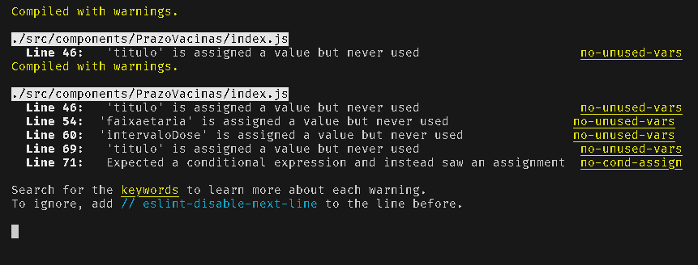

```bash
./src/components/PrazoVacinas/index.js
  Line 46:   'titulo' is assigned a value but never used                      no-unused-vars
Compiled with warnings.

./src/components/PrazoVacinas/index.js
  Line 46:   'titulo' is assigned a value but never used                      no-unused-vars
  Line 54:  'faixaetaria' is assigned a value but never used                 no-unused-vars 
  Line 60:  'intervaloDose' is assigned a value but never used               no-unused-vars 
  Line 69:   'titulo' is assigned a value but never used                      no-unused-vars
  Line 71:   Expected a conditional expression and instead saw an assignment  no-cond-assign
```

O erro fala por si, tem variáveis delatadas e não utilizadas em ./src/components/PrazoVacinas/index.js

Esse tipo de erro não impede a exibição no computador/modo desenvolvimento, porem na versão em produção, a vercel e outros impedem a compilação do frontend, por causa desse erro

### Analisando erro 1

O primeiro alarme fala sobre variavel titulo não sendo usada.
Encontrei um erro gravissimo de lógica em:
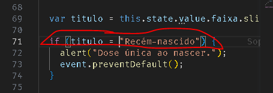

acredito que a intenção era verificar se titulo é IGUAL a "Recém-nascido", mas o que está acontecendo nessa linha

```js
71  if (titulo = "Recém-nascido") {
```

é salvando "Recém-nascido" na variável titulo

para comparação de igualdade, o javascript tem o `==`  composto por dois iguais em sequencia.

- `=` representa atribuir, salvar algo em uma variável

- `==` representa igualdade, sem comparar o tipo das variáveis, e por causa disso uma string "1" será verdadeira na comparação com um numero 1

  ```js
  1 == "1" // true
  ```

- `===` representa igualdade, comparando o tipo da variavel. E neste caso uma string "1" será falsa na comparação com um numero 1

  ```js
  1 == "1" // false
  ```

> dito isto, a comparação de igualdade mais segura é a formada por três símbolos de igual `===`
> e corrigi a linha 71 para se comportar de acordo

### Boas praticas

Durante a leitura do código, sinto muita falta da identação,

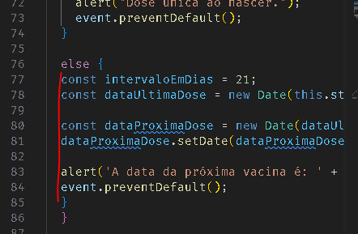

é uma excelente boa pratica organizar o código e deixa-lo identadado, isso facilita a leitura e debub.
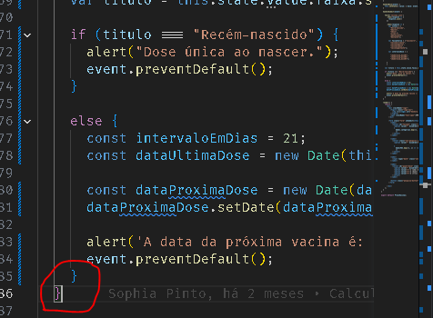
>desta forma fica legível que o segundo } , na linha 36 se refere a uma estrutura superior, enquanto o } da linha 35 é o encerramento do bloco else

### Aviso sobre escopo

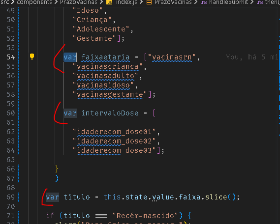

Evite ao máximo utilizar variáveis com `var`, devido ao escopo, variáveis `var` possuem escopo global e por isso são extremamente imprevisíveis, podendo um código bagunçar a estruturara de outro, só pelo fato de usarem variáveis de mesmo nome.

> Recomendo utilizar const ou let, pois estas configurações de escopo são de escopo local, ou seja, a variável só terá ação dentro do bloco onde foi criada.

E esse erro você cometeu no bem próximo do print anterior,
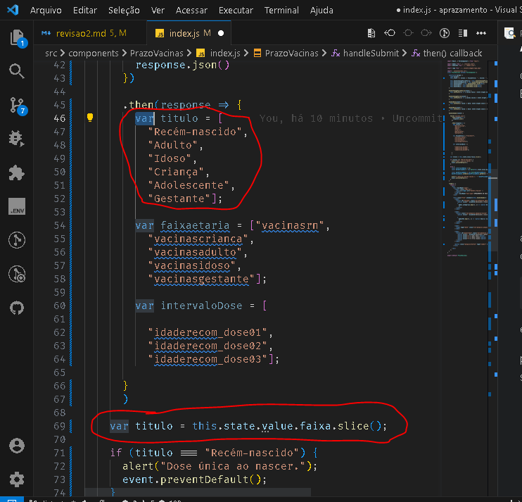
> na imagem acima é possível observar que foi declarado duas vezes a variável titulo, com escopo global, onde uma delas é uma lista de strings, e na segunda é apenas uma string. esse conflito no uso das variáveis causará confusão no comportamento do script.
>

### Recomendo estudar sobre como funcionam as funções arrow function () => {}

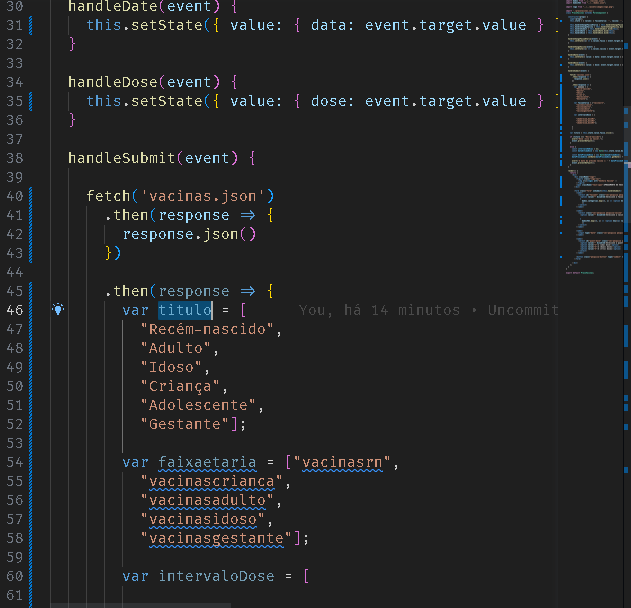
duas vezes foram utilizadas estas funções de forma equivocada

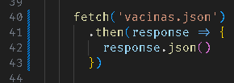
> O objetivo deste primeiro then seria coletar o retorno requisição de fetch e converter response para json, retornando esse json, para que no próximo then fosse tratado esse retorno, ou fosse sobrescrito o retorno da função fetch

> as arrow function são muito uteis para declarar uma função em uma linha com poucos argumentos.

> no entrando, não é o que está acontecendo, pelo fato de estar declarando como bloco `{` e `}`, se torna necessário declarar verbosamente o retorno com `return`
>
> a alternativa para uma função de apenas um argumento, para suprimir o `return` é colocar o retorno logo aspos 0 `=>` sem o uso de `{ }`
>

- Exemplo

> de:
>
> ```js
> .then(response => {
>   response.json()
> })
> ```
>

> para:
>
> ```js
> .then(response =>
>   response.json()
> )
> ```
>
> sem o uso de `{ }`

> ainda podemos compactar em uma só linha:
>  
> ```js
> .then(response => response.json() )
> ```

- OBS: na versão original o retorno era undefined, então os dados retornados pela api com o uso do fetch eram perdidos


### Eportar as variaveis da api sem usar variaveis global

  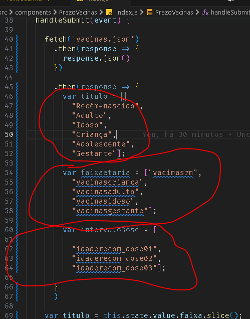

  Como usar variaveis global representam perigo, a forma correta de eportar as variaveis recebidas pela api ~~, e neste caso mokadas,~~ é retornar em formato de objeto e desconstruir ele na variavel que receberia o retorno da api.

- Exemplo, o codigo da imagem acima ficaria:

  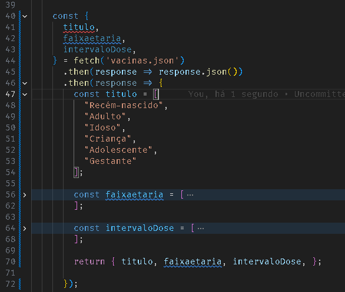

> na linha 70 foi construido o objeto a ser retornado
>
>  ```js
>  70 return { titulo, faixaetaria, intervaloDose, };
>  ```

> e na linha 40 é desconstruido esse objeto, salvando os valores nas  respectivas variaveis
>
>   ```js
>   const { 
>     titulo, 
>     faixaetaria, 
>     intervaloDose, 
>   } = fetch('vacinas.json')
>   ```

A desconstrução não é obrigarorioa, você pode salvar o retorno da função em uma variavel e acessar as variaveis sem desconstruir.

- Exemplo, em vez de desconstruir, criei uma variavel const vacinas:
  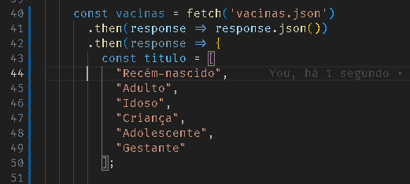
  > e para aceesar o titulo, faixaetaria ou intervaloDose, basta utilizar `vacinas.titulo` ou `vacinas.faixaetaria`
  >
  >```js
  >console.log("Os titulos da Vacina são: ", vacinas.titulo.join(", "))
  >```
  >


